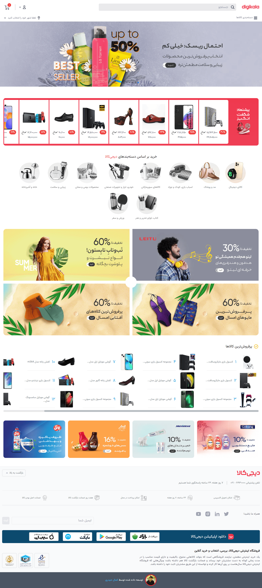

# Digikala Clone NextJs

advance clone of digikala includes products page, single product  page, category, sorting, filtering, JWT authentication, login page, register page, edit user information,  order cart, review and admin dashbord to add new product, accept reviews, add category, details and specification for category and more...

## Using
- NextJs
- MongoDB
- Redux - Toolkit
- JWT

## Demo
See demo on vercel
[Nextjs Digikala Clone](https://digikala-clone-nextjs-p.vercel.app/)

