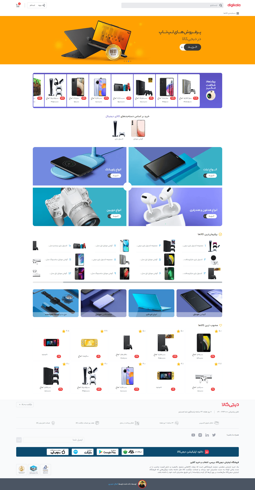
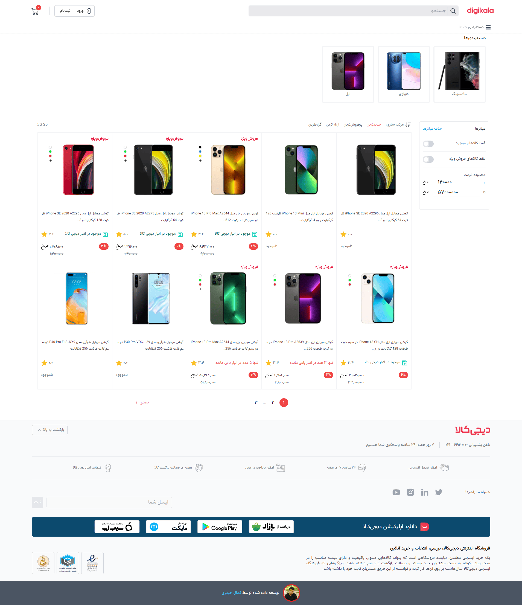
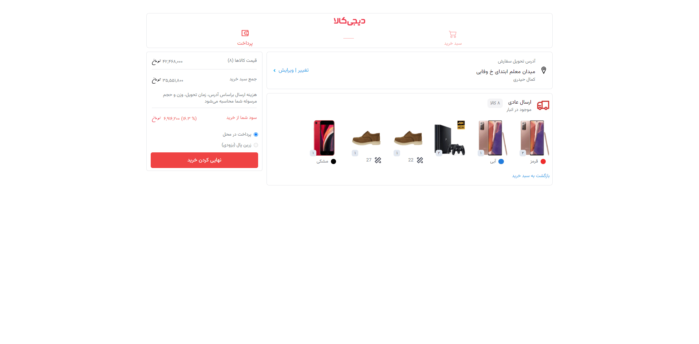
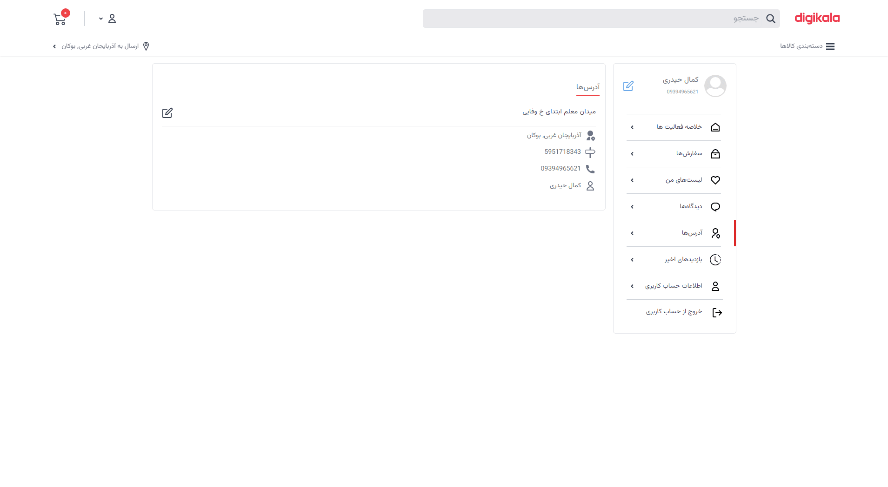
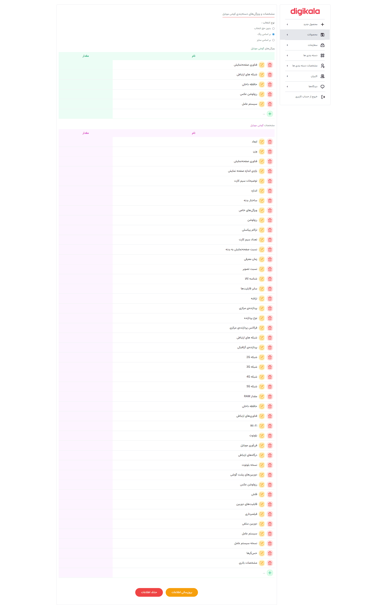
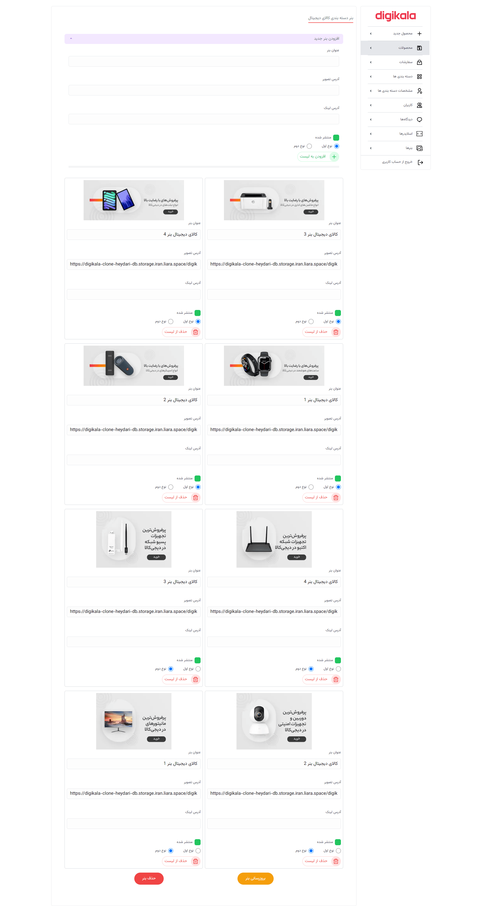
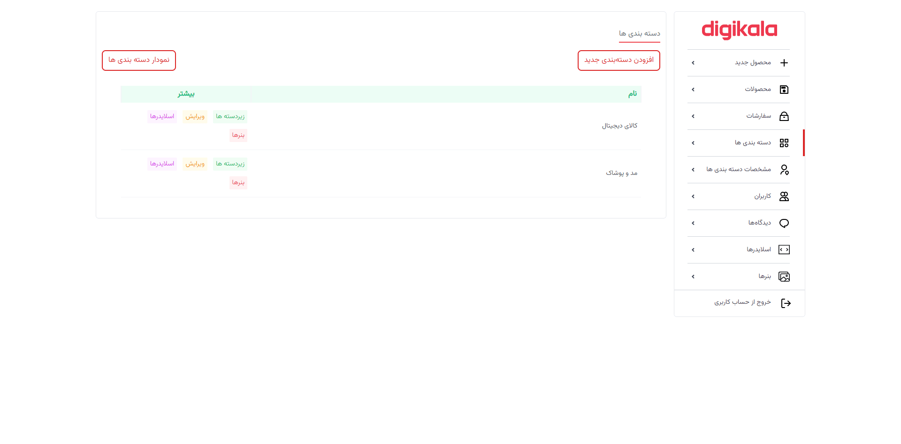
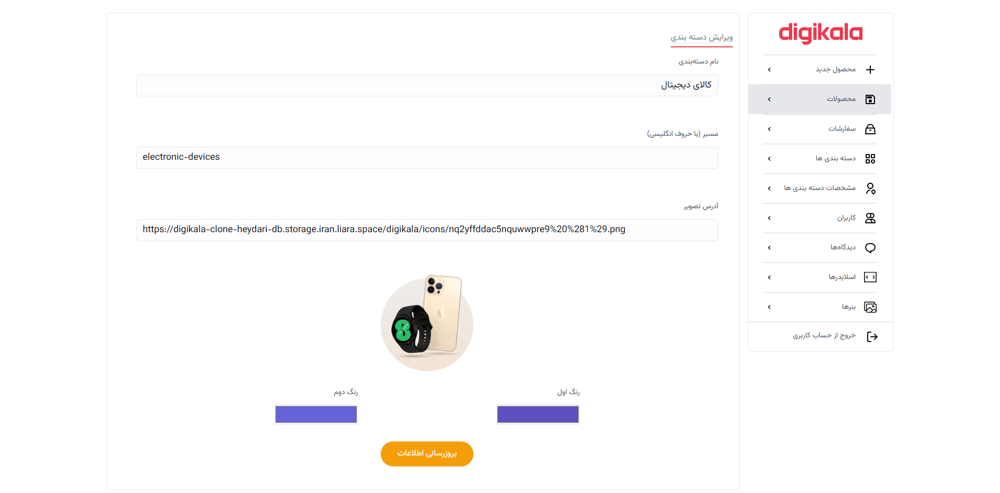
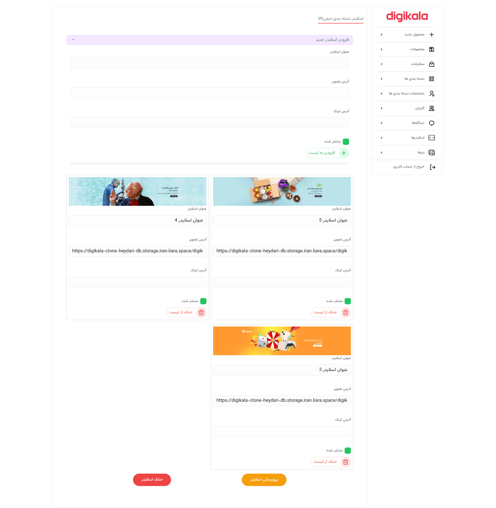

# Digikala Clone NextJs

A advance clone of digikala includes products page, single product page, category, sorting, filtering, JWT authentication, login page, register page, edit user information, order cart, review and admin dashbord to add new product, accept reviews, add category, details and specification for category and more...

## Using

- NextJs
- MongoDB
- Redux - Toolkit
- JWT

## Demo

See demo on vercel
[Nextjs Digikala Clone](https://digikala-clone-nextjs-p.vercel.app/)

### Home Page

### Category Page

### Products Page

### Product Page

### Cart Page

### Shipping Page

### Profile Page

### Adrress Page

### Orders Page

### Admin/Products Page

### Admin/Edit Page

### Admin/Details Page

### Admin/Categories Tree Page

### Admin/Banners Page

### Admin/Categories List Page

### Admin/Category Create Page

### Admin/Sliders Page

